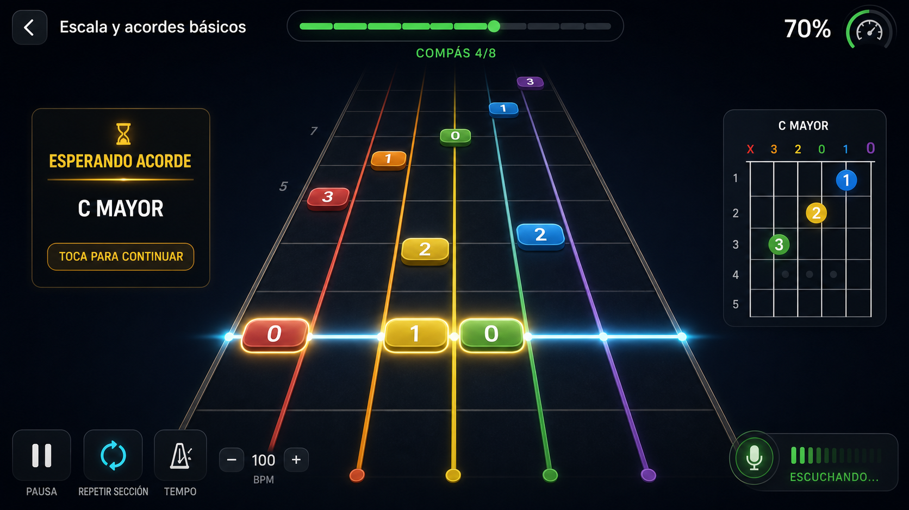

# Diseño del modo educativo con mastil

## Referencia visual

La imagen fija direccion artistica y jerarquia, no posiciones musicales exactas. La implementacion debe corregir cualquier simplificacion del mockup y derivar todos los bloques desde `FretboardRenderModel`.

## Objetivo UX

El alumno debe entender en menos de un segundo:

1. Que cuerda tocar.
2. Que traste usar.
3. Cuando tocar.
4. Si la sesion avanza o espera.
5. Que falta para validar una nota o acorde.

## Layout principal

- Orientacion primaria horizontal.
- Mástil/carretera ocupa al menos 60% del ancho y 70% del alto util.
- Seis cuerdas contables en todo momento, numeradas semanticamente 6 grave a 1 aguda.
- Perspectiva con punto de fuga superior central y linea de ejecucion en el tercio inferior.
- Notas futuras aparecen por encima de la linea y viajan hacia el alumno.
- Panel izquierdo: estado educativo y accion requerida.
- Panel derecho: diagrama de acorde solo cuando el objetivo es acorde.
- Barra superior: titulo, progreso, compas y velocidad.
- Barra inferior: pausa, repetir seccion, tempo y microfono.

## Codificacion visual

- Un color estable por cuerda durante toda la aplicacion.
- El color no es la unica señal: cada bloque incluye numero de traste y posicion espacial.
- Cuerda al aire muestra `0`.
- Cuerda silenciada del acorde muestra `X` en el diagrama y no genera bloque evaluable.
- Notas simultaneas comparten exactamente la misma profundidad/tick.
- Duracion se expresa por longitud del bloque; un ataque corto conserva tamaño tactil/visual minimo.
- Ligadura extiende el bloque; no crea un nuevo frente de ataque.
- Las grace notes no se muestran en E08; el importer las registra como diagnostico.

## Estados visuales

### `running`

- Movimiento continuo, controles secundarios atenuados.
- Target siguiente con borde sutil.

### `waitingForTarget`

- Posicion musical congelada.
- Target pulsa visualmente sin desplazarse.
- Texto `ESPERANDO NOTA` o `ESPERANDO ACORDE`.
- Microfono muestra `ESCUCHANDO`.
- Notas futuras permanecen visibles pero atenuadas.

### `validating`

- Evidencia parcial: verde detectado, ambar debil, gris pendiente.
- Para acordes se muestra cada clase tonal requerida; no se afirma una cuerda fallida.

### `successFeedback`

- Flash verde contenido de 250 ms, sin bloquear legibilidad.
- No usar pantalla completa ni animacion superior a 400 ms.

### `reentry`

- Cuenta visual `1` para un pulso o cuenta completa al reanudar desde pausa; E08 no reproduce click.
- Eventos ya superados aparecen confirmados y no vuelven a bloquear.

### `failure`

- Mensaje recuperable y CTA; el error no se comunica solo mediante color.

## Perspectiva y movimiento

- El renderer recibe tick actual y ticks de eventos.
- `distanceTicks = event.startTick - currentTick`.
- La proyeccion transforma distancia y cuerda a coordenadas; no se acumulan pixeles por frame.
- Cambiar velocidad conserva tick y solo cambia relacion tiempo real/tick.
- Pausar congela tick; glow y escucha pueden seguir animados por un reloj decorativo separado.

## Implementacion Flutter

- `CustomPainter` para fondo, cuerdas, trastes, bloques, linea y efectos.
- Widgets para paneles, controles, textos y semantica.
- `RepaintBoundary` alrededor del canvas.
- El painter recibe un modelo inmutable y no accede a BLoC, streams, XML ni engines.
- Filtrar eventos a la ventana visible antes de pintar; objetivo inicial <= 40 bloques visibles.
- No construir un widget por nota.
- Evitar blur de pantalla completa, sombras sin limites y allocations por frame.
- Precargar paints, paths repetibles y recursos.

## Responsive

- Movil horizontal: panel izquierdo compacto; diagrama de acorde superpuesto a la derecha.
- Tablet/Web >= 900 px: ambos paneles laterales completos.
- Ancho util < 640 px: controles secundarios pasan a menu; nunca se ocultan target, velocidad, pausa ni microfono.
- En vertical E08 muestra obligatoriamente una pantalla instructiva para girar el dispositivo; no inicia gameplay hasta volver a horizontal.
- Safe areas respetadas.

## Accesibilidad

- Targets tactiles >= 48 dp.
- Contraste WCAG AA en textos esenciales.
- Semantica: `Cuerda 3, traste 7, nota Re 4, esperando`.
- Estado no dependiente solo del color.
- Opcion futura de paleta para daltonismo; E08 reserva patrones/bordes distintos por cuerda.
- `reduce motion`: elimina particulas y reduce pulsos, sin alterar el tiempo musical.

## Presupuesto de rendimiento

- Objetivo 60 FPS en dispositivos de referencia.
- Frame build+raster p95 <= 16,7 ms durante una leccion de 1.000 eventos.
- Cero parseo XML, DSP o asignaciones de listas completas dentro de `paint`.
- La recepcion de DSP no puede forzar repaint de paneles que no cambian.
- Prueba prolongada de 10 minutos sin crecimiento sostenido de memoria ni listeners.

## Criterios visuales de aceptacion

- Se distinguen las seis cuerdas y el sentido temporal.
- Una nota identifica cuerda y traste sin consultar otro panel.
- Un acorde aparece alineado en un unico instante.
- Espera, escucha, acierto y reentrada son inequívocos.
- No hay overflow en movil horizontal, tablet y Web.
- La UI queda fluida aunque el analyzer emita observaciones con frecuencia alta.
